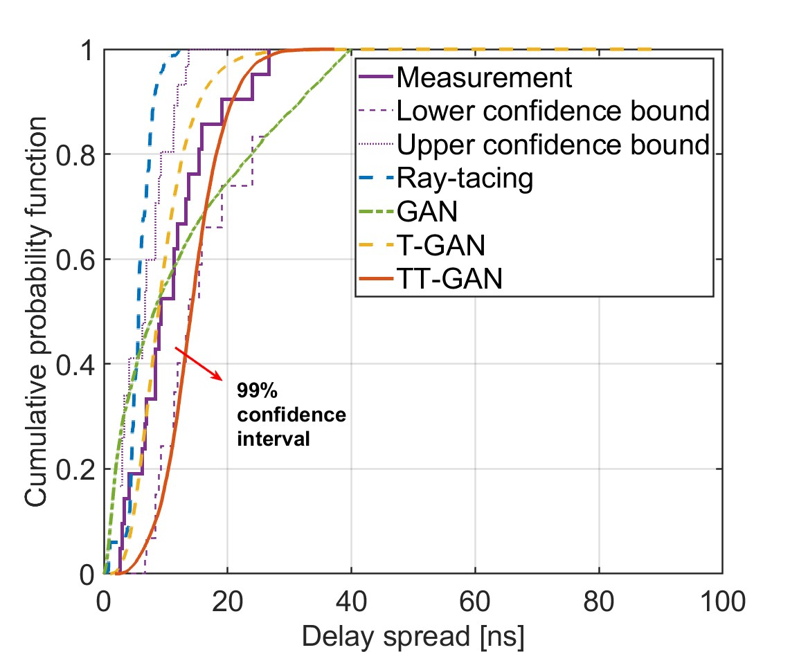

# TT-GAN
This repository contains the simulation dataset and code for the submitted paper "Transfer Learning Enabled Transformer based Generative Adversarial Networks (TT-GAN) for Terahertz Channel Modeling and Generating". The code is based on [TransGAN](https://github.com/VITA-Group/TransGAN) and [mmwchanmod](https://github.com/nyu-wireless/mmwchanmod)

## Data
The simulation data is provided, which can be generated by the [QuaDriGa](https://quadriga-channel-model.de/) software in the matlab with the provided statistics in the file "TWC_Indoor_Corridor_LOS.conf". 
```
matlab coeff_generation_3gpp.m
```

## GAN
The T-GAN and TT-GAN are implemented in transformer-gan.py and ttgan.py respectively. The ttgan.py is fine-tuned on the pre-trained tgan models. The number of epochs is set as 10000


## Evaluation
The tt-gan are compared with the basic gan, t-gan and ray-tracing.

